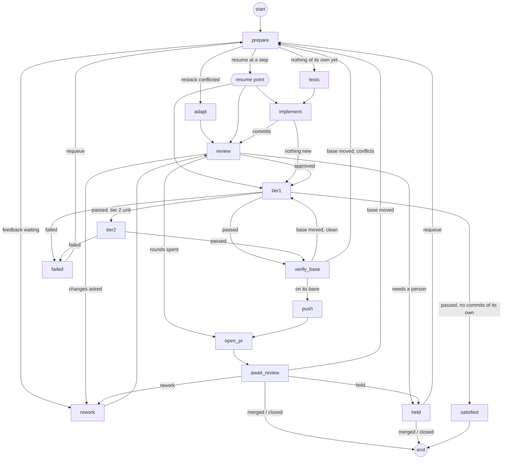

# The unit graph

**Status: design.** Nothing here is built yet. This document is what the
implementation is specified against: it says which part of the pipeline moves
onto [LangGraph](https://docs.langchain.com/oss/python/langgraph/overview),
which part stays as it is, and how the two meet.

## Why

A unit's lifecycle is a graph, written today as hand-rolled control flow.
`UnitRunner.run` (`pipeline/stack_runner.py`) branches on a recorded step
(`resume_from`) and decides which steps to run next. `checkpoint()` and
`record_step` persist where it got to. `reclaim_stale` puts a unit back after
its process was killed. And a dozen event handlers in `pipeline/events.py`
reach into the unit store to send a unit back, hold it, or move it.

All of this is ordinary workflow engineering:

- durable steps;
- resuming after a crash;
- waiting days for a person;
- routing on a step's result.

LangGraph is a widely used open-source framework for exactly that. Moving the
lifecycle onto it is meant to buy four things:

- **Less custom orchestration.** The framework owns step order, checkpoints
  and resume, so we stop maintaining our own.
- **A lifecycle that reads as a graph.** The nodes and edges are the
  specification, and they can be drawn.
- **A framework others already know.** A contributor or an agent who knows
  LangGraph can read and change the lifecycle without learning a bespoke
  engine first.
- **Observability per step.** Each node is a span, steps stream as events,
  and the state of any unit's run can be inspected.

The agents themselves are unchanged. They are still external processes
reached through the `AgentRuntime` seam (`docs/agent-runtimes.md`). LangGraph
orchestrates around them and does not replace them.

## The boundary: what moves, what stays

The open-source framework (MIT, 1.2.x at the time of writing) covers the
lifecycle of one unit well:

- checkpointed state;
- [`interrupt()`](https://docs.langchain.com/oss/python/langgraph/interrupts)
  to wait for input, with no documented time limit, and
  `Command(resume=...)` to continue;
- [durability modes](https://reference.langchain.com/python/langgraph/types/Durability),
  of which `"sync"` writes every checkpoint before the next step;
- [retry and timeout policies](https://docs.langchain.com/oss/python/langgraph/fault-tolerance)
  on nodes;
- [custom stream events](https://docs.langchain.com/oss/python/langgraph/streaming).

What it does not cover is everything above a single unit:

- scheduling across runs;
- locks and resource limits;
- a scheduler, crons or webhooks.

Those belong to LangSmith's paid deployment
([agent server](https://docs.langchain.com/langsmith/agent-server),
[cron jobs](https://docs.langchain.com/langsmith/cron-jobs),
[double-texting](https://docs.langchain.com/langsmith/double-texting)). So the
line falls where a unit ends:

| Moves into the unit graph | Stays abk code |
|---|---|
| Step order and branching (`UnitRunner.run`) | Choosing what starts: `ready_units`, the depth caps, `max_units_in_progress`, slot order, `max_concurrent_stacks` |
| `checkpoint()`, `record_step`, `resume_from`, `starting_step` | The driver: the tick timer, `cmd_tick`, a pass's refresh loop |
| In-run state: review rounds, the approved commit, deferred follow-ups, pending replies, the predecessor note | Polling the forge (`pr_poller.py`): the source of events |
| Requeue after a kill (`reclaim_stale`) | Branch locks, repo turns, the tier 2 lock |
| Waiting in review or held, and what `events.py` does to a waiting unit | Git and forge work: restack and adapt mechanics, the approved-commit push gate, the commit gate, the policy hook, forges, profiles |
| Stopping between steps for usage | The usage guard's decision (`usage_guard.py`), which a node asks |

### Who holds what

- **`runs/units.json`** stays the scheduling record. It holds each unit's
  identity, change, repo, tier, dependencies, state, branch, pull request and
  history. It is versioned beside the specs, the unit graph page is drawn from
  it, and `ready_units` reads it. What leaves it is in-run progress: the
  fields that say where inside a unit a run got to.
- **The checkpoint** holds a run's progress. There is one LangGraph thread per
  unit, with `thread_id` equal to the unit id.
- **git** holds the work: every step that produces anything ends in a commit,
  as it does now.

One rule keeps these from drifting apart: **anything outside a running unit
changes that unit only by resuming its thread.** A merge that restacks a
child, a review comment, a requeue: each is a `Command(resume=...)` on the
unit's thread, which the graph routes like any other input. Nothing writes
into a waiting unit's state from the side.

## The graph

The edges are today's transitions; `stack_runner.py`'s docstrings are the
reference for each condition until this replaces them. The nodes:

| Node | Does | Wraps (from `wiring.build_runner`) |
|---|---|---|
| `prepare` | Worktree, fetch, move the branch onto its base; picks the next node from what is on the branch and in state | worktree setup, `restack_onto`, `branch_commits` |
| `tests` | The tests-first commit | `run_claude`, `commit` |
| `implement` | The implementation commit; nothing new against an exhausted window is a pause, not a failure | `run_claude`, `commit`, `may_start` |
| `review` | One review round; records the verdict, findings, follow-ups and the approved commit | `run_review` / `run_rework_review` |
| `rework` | Addresses review or forge feedback and records the builder's replies | `run_rework`, `commit` |
| `adapt` | Ports the old work onto a base it could not be rebased onto, and accounts for each test | the adapt agent, `check_test_decisions` |
| `tier1`, `tier2` | The test tiers | `tier1`, `run_tier2` |
| `verify_base` | The fresh-base check before a push | fetch, `fresh_base`, `restack_onto` |
| `push` | Pushes only the approved commit | the push gate, `push` |
| `open_pr` | Opens or updates the pull request, posts replies and the PR body | `open_pr`, replies, labels |
| `await_review` | **Interrupt.** Waits for the forge: rework, a merge, a close, a hold, a moved base | — |
| `held` | **Interrupt.** Waits for a person: requeue, merge, close | — |
| `satisfied`, `failed` | Terminal for this thread; `failed` waits for a requeue | `close_pr` for satisfied |

The nodes wrap the callables `wiring.build_runner` already builds. None of the
agent, git or forge logic is rewritten; what changes is who decides what runs
next. Node names are an enum, also used as the routers' return values, so a
misspelled edge fails when the graph is compiled, not in the middle of a run.

### State

The state is one pydantic model, `UnitRun`, the in-run fields `StoredUnit`
carries today plus what routing needs:

- **identity:** the unit id, its groups, its change;
- **progress:** the review rounds so far (each round's findings and the
  builder's response), the approved commit, deferred follow-ups, pending
  replies, the predecessor note;
- **step results routing reads:** commits this run produced, the last verdict,
  tier results, why a run stopped;
- **the last event received,** so a resumed node knows why it is running.

Updates are partial: each node returns only the fields it changes. Anything a
person reads (state, pull request, history) is also written to `units.json`
by the node that changes it, as today. The graph diagram and `abk status`
keep working unchanged.

## Events become resume commands

The poller stays exactly what it is: snapshot, diff, report. What changes is
the handler. Today it rewrites the unit in the store. Instead it resumes the
unit's thread with a command:

| Event | Command | Routed by |
|---|---|---|
| A review asking for changes, a new comment, `agent-rework`, newly failing checks, a merge conflict | `rework{reason, feedback}` | `await_review` → `rework` |
| The parent merged, or the base was rewritten | `base_moved{new_base}` | `await_review` → `prepare` (a running unit sees it at its next node) |
| `agent-hold` | `hold` | → `held` |
| Merged | `merged` | → end; `units.json` records the merge and the scheduler restacks children by resuming their threads |
| Closed unmerged | `closed` | → end |
| `abk requeue` | `requeue{restart}` | `held` / `failed` → `prepare`; `restart` starts a fresh thread |

An event for a unit whose thread is mid-node is kept and delivered when that
node returns. This is what the branch-lock deferral does today, and the
poller already replays a deferred event.

## Durability and idempotency

- **Checkpointer:** `AsyncSqliteSaver` with WAL, in the state directory beside
  the unit store, and `durability="sync"`: the host can lose power at any
  moment. It is SQLite rather than a database server: one tick process writes
  it, with a handful of threads in flight, and a server would add the failure
  modes the pipeline exists to work through.
- **Serialisation:** an explicit `allowed_msgpack_modules` list for the state
  model's types, with strict msgpack otherwise. Checkpoint deserialisation has
  had remote-code-execution advisories (fixed in langgraph-checkpoint 4.1.1),
  and a type left off the list fails a resume, not a build. A test loads a
  checkpoint holding every state type.
- **A node killed partway re-runs from its start.** That is LangGraph's
  contract, and it is the same as today's step boundaries. So each node first
  checks git:
  - commits already on the branch from this step;
  - the pushed commit;
  - an open pull request.
  It does nothing twice. A killed agent process leaves uncommitted work, which
  the node's re-run commits as `wip:` before continuing, as `reclaim_stale`
  does now.
- **Timeouts kill the process group.** A node's `TimeoutPolicy` cancels its
  task, and cancelling a task does not stop a child process. The runtime call
  inside a node owns the agent's process group and kills it on cancellation.
- **Threads end when units do.** A thread is deleted when its unit merges, is
  closed or is satisfied. An unfinished unit is exactly a thread that still
  exists.

## Usage pauses

Before an agent step a node asks the usage guard, as `checkpoint()` does now.
When the guard refuses, the node interrupts with `{reason, until}`; it does not
put the unit back to `planned`. The tick resumes every thread interrupted that
way once the guard allows: it asks again on every tick, as the pause marker
does now (`pipeline/pause.py`). A step is never interrupted while it runs:
interrupts happen only at node boundaries.

## Concurrency

- One tick process runs the threads on asyncio, at most `max_concurrent_stacks`
  executing at once. A thread waiting in an interrupt costs nothing.
- The scheduler is unchanged in what it decides. `ready_units` picks what
  starts, and existing work goes first. What it does changes: it **starts** a
  thread for a new unit and **resumes** threads that have something to do (an
  event, a usage pause that has cleared).
- Branch locks are taken by each node that touches the branch, not around the
  whole unit. A thread waiting for review holds no lock, so an event handler
  never finds the unit busy for days.
- Repo turns and the tier 2 lock are taken inside the nodes that need them, as
  the wrapped callables do now.

## Observability

- **A span per node,** with the unit id, change and step as attributes. Agent
  spans nest under it.
- **Stream events** from a node (`get_stream_writer`) carry the agent's
  progress lines into the unit's run log (`runs/unit-logs/`), as `on_event`
  does now.
- **The graph itself** is drawn from the compiled graph into this document and
  the docs, so the diagram cannot drift from the code.
- **LangSmith tracing** is supported by the framework, optional, and off by
  default. Nothing in the pipeline depends on it.

## Moving the units in flight

The switch happens once, on the release that removes the old engine:

- each stored unit with a resume step or waiting feedback seeds a thread
  positioned at the node that step names;
- `in_review` and `held` units seed a thread already waiting in
  `await_review` or `held`;
- a unit with nothing in flight needs no thread until it starts.

After the switch `UnitRunner`'s control flow, `resume_from`, `checkpoint()`
and `reclaim_stale`'s requeue are removed, and `StoredUnit` loses its in-run
fields. The callables in `wiring.py` and everything they reach stay.

## Testing

- **Nodes** are tested alone with the same injected fakes the stack runner's
  tests use today.
- **Paths** are tested through the compiled graph. The stack runner's
  scenarios are ported one for one (build, review rounds, rework, adapt,
  satisfied, holds, spent rounds, moved bases), so the migration is checked
  against the behaviour it replaces.
- **Resume** tests:
  - kill the process mid-node and resume the thread in a new process, so that
    node re-runs and does nothing twice;
  - deliver an event to a thread that has waited across a restart;
  - a usage interrupt cleared by a later tick;
  - a checkpoint holding every state type loads under the allowlist.
- **Acceptance:** one real unit built end to end through the graph, reviewed,
  pushed, opened, then resumed by a real review comment.

## Dependencies

`langgraph` and `langgraph-checkpoint-sqlite` become core dependencies, pinned
together; the checkpoint packages have moved a major version within a year.
The framework brings `langchain-core`. Nothing else from LangChain is used:
there are no LangChain models, prompts or tools, since agents are reached
through `AgentRuntime`.
