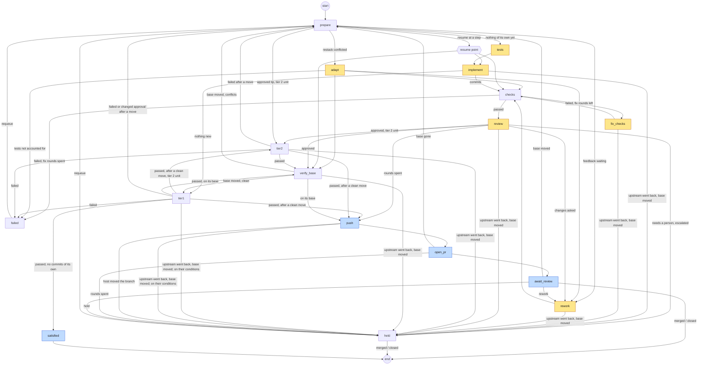

# The unit graph

**Status: built.** The graph is the only engine. `graph/` holds the `UnitRun`
state, the node enum, the SQLite checkpointer with its allowlist and the
compiled graph, and `graph/unit.run_unit` runs a unit on it, over the
callables `wiring.build_runner` binds: `prepare`, `adapt`, `tests`,
`implement`, `checks`, `fix_checks`, `review`, `rework`, `tier1`, `tier2`,
`verify_base`, `push`, `open_pr`, `await_review`, `satisfied`, `held` and
`failed`, joined by the edges below. Before a step that starts work or leaves
the machine the nodes consult `upstream_incomplete` and the hold, and a unit
whose base moved is held. `await_review` and `held` are interrupts: a unit
waiting in review or held waits there holding no branch lock and no slot.
`resume_unit` delivers an event to a thread as a resume command and stops,
leaving the thread at the node the event routes to. A usage refusal before an
agent step interrupts the thread, and a run killed mid-node is resumed at that
node. A tick drives each unit through `run_unit`: it starts the unit's thread,
or resumes one a killed or paused run left (a `running` unit that has a thread,
whose branch no live process holds). The poller's events and `abk requeue`
reach a unit that has a thread through `resume_unit`, which runs no node but
the wait; the tick runs the thread in a slot. The first tick on this version
moves the units the previous one left in flight onto threads (see Moving the
units in flight). One difference from the old runner: the `chore:` commit of
uncommitted work before each review round is not made, as every step already
ends in its own commit. This document is what the implementation is specified
against: it says which part of the pipeline moved onto
[LangGraph](https://docs.langchain.com/oss/python/langgraph/overview), which
part stayed as it was, and how the two meet.

## Why

A unit's lifecycle is a graph, and was written as hand-rolled control flow.
`UnitRunner.run` (`pipeline/stack_runner.py`) branched on a recorded step
(`resume_from`) and decided which steps to run next. `checkpoint()` and
`record_step` persisted where it got to. `reclaim_stale` put a unit back after
its process was killed. And a dozen event handlers in `pipeline/events.py`
reach into the unit store to send a unit back, hold it, or move it.

All of this is ordinary workflow engineering:

- durable steps;
- resuming after a crash;
- waiting days for a person;
- routing on a step's result.

LangGraph is a widely used open-source framework for exactly that. Moving the
lifecycle onto it is meant to buy four things:

- **Less custom orchestration.** The framework owns step order, checkpoints
  and resume, so we stop maintaining our own.
- **A lifecycle that reads as a graph.** The nodes and edges are the
  specification, and they can be drawn.
- **A framework others already know.** A contributor or an agent who knows
  LangGraph can read and change the lifecycle without learning a bespoke
  engine first.
- **Observability per step.** Each node is a span, steps stream as events,
  and the state of any unit's run can be inspected.

The agents themselves are unchanged. They are still external processes
reached through the `AgentRuntime` seam (`docs/agent-runtimes.md`). LangGraph
orchestrates around them and does not replace them.

## The boundary: what moves, what stays

The open-source framework (MIT, 1.2.x at the time of writing) covers the
lifecycle of one unit well:

- checkpointed state;
- [`interrupt()`](https://docs.langchain.com/oss/python/langgraph/interrupts)
  to wait for input, with no documented time limit, and
  `Command(resume=...)` to continue;
- [durability modes](https://reference.langchain.com/python/langgraph/types/Durability),
  of which `"sync"` writes every checkpoint before the next step;
- [retry and timeout policies](https://docs.langchain.com/oss/python/langgraph/fault-tolerance)
  on nodes;
- [custom stream events](https://docs.langchain.com/oss/python/langgraph/streaming).

What it does not cover is everything above a single unit:

- scheduling across runs;
- locks and resource limits;
- a scheduler, crons or webhooks.

Those belong to LangSmith's paid deployment
([agent server](https://docs.langchain.com/langsmith/agent-server),
[cron jobs](https://docs.langchain.com/langsmith/cron-jobs),
[double-texting](https://docs.langchain.com/langsmith/double-texting)). So the
line falls where a unit ends:

| Moves into the unit graph | Stays abk code |
|---|---|
| Step order and branching (`UnitRunner.run`) | Choosing what starts: `ready_units`, the depth caps, `max_units_in_progress`, slot order, `max_concurrent_stacks` |
|  | Merge-gated dependencies (`merge_before`, from `Needs: … merged`), applied by `waiting_on`/`ready_units`: the dependent waits for the merge even in one repo and starts on the trunk |
| Where a run got to: the thread's position replaces `checkpoint()`, `record_step` and `resume_from` | The driver: the tick timer, `cmd_tick`, a pass's refresh loop |
| In-run state: review rounds, deferred follow-ups, pending replies and the comments they answer | Polling the forge (`pr_poller.py`): the source of events |
| Recovery after a kill: the tick resumes the thread | Branch locks, repo turns, the tier 2 lock |
| Waiting in review or held, and what `events.py` does to a waiting unit | Git and forge work: restack and adapt mechanics, the approved-commit push gate, the commit gate, the policy hook, forges, profiles |
| Stopping between steps for usage | The usage guard's decision (`usage_guard.py`), which a node asks |

### Who holds what

- **`runs/units.json`** stays the scheduling record. It holds each unit's
  identity, change, repo, tier, dependencies, state, branch, pull request and
  history. It is versioned beside the specs, the unit graph page is drawn from
  it, and `ready_units` reads it. What left it is in-run progress: where inside
  a unit a run got to, which is the thread's position, and the review rounds,
  deferred follow-ups, pending replies and the comments they answer, which are
  the thread's state. Two in-run fields stay, because something writes them
  with no run in progress: `approved` (the push gate and `build_restack` read
  and write it) and `predecessor_note` (`build_restack` writes it). `resume_from`
  and `classic_run` stay as read-only legacy: an old store's step and in-run
  keys, read only by `graph.convert`, which clears them once the thread holds them.
- **The checkpoint** holds a run's progress. There is one LangGraph thread per
  unit, with `thread_id` equal to the unit id.
- **git** holds the work: every step that produces anything ends in a commit,
  as it does now.

One rule keeps these from drifting apart: **anything outside a running unit
changes that unit only by resuming its thread.** A merge that restacks a
child, a review comment, a requeue: each is a `Command(resume=...)` on the
unit's thread, which the graph routes like any other input. Nothing writes
into a waiting unit's state from the side.

## The graph

Amber nodes run an agent. Blue nodes are where the unit meets the code host,
and the runner does that itself, in code, without an agent. Unshaded nodes are
git, tests and bookkeeping. Two nodes are not shaded but can call an agent: the
restack in `prepare` and `verify_base` hands a conflict it cannot settle to the
conflict resolver, and nothing else in them does.

The edges are the transitions the routers in `graph/` choose; their docstrings
are the reference for each condition. The nodes:

| Node | Does | Wraps (from `wiring.build_runner`) |
|---|---|---|
| `prepare` | Worktree, fetch, move the branch onto its base; picks the next node from what is on the branch and in state | worktree setup, `restack_onto`, `branch_commits` |
| `tests` | The tests-first commit | `run_claude`, `commit` |
| `implement` | The implementation commit; nothing new against an exhausted window is a pause, not a failure | `run_claude`, `commit`, `may_start` |
| `checks` | Tier 1 on the branch **before a reviewer is asked**, on the committed tree. Passing records the commit, so `tier1` after approval is not repeated on it | `tier1`, `commit` |
| `fix_checks` | Hands the failed checks' output to the builder, bounded by `limits.max_check_rounds`, then back to `checks`. Records no reply, as there is no reviewer to answer | `run_rework`, `commit`, `may_start` |
| `review` | One review round; records the verdict, findings, follow-ups and the approved commit. After a person's rework it is also given their comments, quoted, each with the builder's reply or `(no reply)` | `run_review` / `run_rework_review` |
| `rework` | Addresses review or forge feedback and records the builder's replies | `run_rework`, `commit` |
| `adapt` | Ports the old work onto a base it could not be rebased onto, and accounts for each test | the adapt agent, `check_test_decisions` |
| `tier1`, `tier2` | The test tiers. `tier1` is **not** run after a review: approval leaves the branch as `checks` judged it. It runs for a unit that produced nothing (judged on tier 1 alone) and on a branch moved cleanly onto a new base, before the push. `tier2` follows approval for a tier 2 unit | `tier1`, `run_tier2` |
| `verify_base` | The fresh-base check before a push | fetch, `fresh_base`, `restack_onto` |
| `push` | Pushes only the approved commit | the push gate, `push` |
| `open_pr` | Opens or updates the pull request, posts replies and the PR body | `open_pr`, replies, labels |
| `await_review` | **Interrupt.** Waits for the forge: rework, a merge, a close, a hold, a moved base | — |
| `held` | **Interrupt.** Waits for a person: requeue, merge, close. The store state the hold leaves (`held`, or `planned` for a unit held before a step) is recorded by the node that held, not by this one, which runs again from its start when resumed | — |
| `satisfied`, `failed` | Terminal for this thread; `failed` waits for a requeue. A satisfied unit's thread is deleted, its groups ticked and an open pull request closed with the reason | `close_pr` for satisfied |

Between steps a unit is held, not stopped: before `implement`, `fix_checks`,
`review`, `rework`, `tier2` (unless the branch just moved), `verify_base` (and
`tier1` for a unit that produced nothing, and `push` when its rounds are spent)
the run asks whether its upstream went back for rework or its base moved or was
rewritten since `prepare` took the tip, and goes to `held` with the unit
`planned` if so. A step already begun is finished.

A base that moves before the push, a pull request refused for a missing base, a
failing tier 1 or tier 2 after a clean move, and a move that changed what review
approved all go back to `prepare` once (`rebased`), so the restack resolves under
the usage gate and review reads the result; a second time the unit is held
`planned` for the next tick, so a base that keeps moving cannot loop.

### Who touches the code host

An agent never changes anything on the code host. The runner does all of it,
at fixed nodes, from the agent's *output*:

| Direction | What | Where | Done by |
|---|---|---|---|
| Read | New comments, review decisions, labels, check results, mergeability | the poller, which resumes `await_review` | the runner (`pr_poller`, the forge) |
| Read | The reviewer's own words, fetched when a rework is queued | `events.on_rework`, saved as the unit's feedback | the runner |
| Read | A failing check's log | the same, for a failing-checks rework | the runner |
| Read | Its own pull request (`gh pr view`/`diff`, `az repos pr show`: the forge's read commands, nothing that writes) | the review | the review agent |
| Into the agent | All of the above | placed in the `rework` / `fix_checks` prompt as text | the runner |
| Write | The branch | `push`, the approved commit only, with a lease | the runner |
| Write | The pull request: open or update, body, state labels | `open_pr` | the runner |
| Write | Replies to review comments | `open_pr`, from the JSON the rework agent ends with (`{"replies": [...]}`) | the runner, after the push |
| Write | Closing a pull request whose work already landed | `satisfied` | the runner |
| Never | Merge, vote, approve, the raw API | refused on every repo by the policy hook and the ACP deny list | nobody; a person merges |

So the agent hands back structured text and the runner posts it. The rework
prompt tells the agent not to post and to end with that JSON, so the replies
describe the code as the reviewer will see it once it is pushed.

What an agent *may* run is narrower than it looks, and deliberate. A build agent
is allowed its forge's read commands (`gh pr view` and `gh pr diff` on GitHub,
`az repos pr show` on Azure DevOps) and nothing else on the host; the review
agent has only `git diff`, `git log` and `git show`. The runner puts the
feedback an agent needs into its prompt, and the read commands are there for
whatever the prompt does not carry, so an agent may look at its own pull request
when it judges that useful.

The tracks (health, improve, recommend, propose) use the same freedom: their
prompts tell the agent to run `gh pr view <url> --json state` to see whether a
PR in a follow-up list has merged. That read stays with the agent. The line that
matters is the one in the table: agents read the host as they need to, and never
change it.

### Checks before review

Tier 1 used to run once, after the reviewer approved, so a branch that did not
lint or type-check was reviewed twice over: once to approve it, and again after
the failure came back. The reviewer is also the more expensive model. Now every
route into `review` goes through `checks` first, including a rework: the
builder's fix for a reviewer's point can break the build as easily as the first
draft could.

A failure is saved on the unit as feedback (`tier 1 failed:` and the output) and
goes to `fix_checks`, up to `limits.max_check_rounds` times (3 by default;
`null` is no limit; 0 means no fix attempt, not no check: it is the only gate
before a review and a push). The count is per round of review: `checks` runs at
the top of each round and the budget starts again, so a rework that breaks the
build gets its own attempts. A fix that leaves the branch unchanged ends the
run whatever the limit, as asking again would be the same question of the same
tree. Only when the budget is spent does the unit go to `failed`, with the
output still saved, and `abk requeue --rework` is how it
gets another go with that output in front of the agent. A pause during a fix
keeps the saved failure, so the resume fixes what was found rather than finding
it again; a successful fix clears it, so a run stopped before its review does
not redo a fix that is already on the branch.

Nothing runs tier 1 after the review. A reviewer reports and the builder fixes,
so approval leaves the branch exactly as `checks` judged it. The branch is
checked again only when it changes: a clean move onto a new base
(`verify_base` → `tier1` → push) is checked before it is pushed, and a move with
conflicts goes through `adapt`, which accounts for its own tests and then back
through `checks` and `review`, since the resolution rewrote the commit that was
approved.

The nodes wrap the callables `wiring.build_runner` already builds. None of the
agent, git or forge logic is rewritten; what changes is who decides what runs
next. Node names are an enum, also used as the routers' return values, so a
misspelled edge fails when the graph is compiled, not in the middle of a run.

### State

The state is one pydantic model, `UnitRun`: the in-run progress that used to
sit in the unit store, plus what routing needs:

- **identity:** the unit id, its groups, its change;
- **progress:** the review rounds so far (each round's findings and the
  builder's response), the approved commit, deferred follow-ups, pending
  replies, the predecessor note;
- **step results routing reads:** commits this run produced, the last verdict,
  tier results, why a run stopped;
- **the last event received,** so a resumed node knows why it is running;
- **the running agent's session id,** written as soon as the runtime reports it
  and cleared when the node completes (see Session capture and resume);
- **what the build path routes on:** the base the unit is on once `verify_base`
  moved it, the commits on the branch when `prepare` finished, the branch's tip
  when the last node finished (what a re-run compares with), whether feedback
  was waiting at the start, the fix rounds and the review round so far, and
  whether the checks passed, the branch is empty or `verify_base` moved it, the
  base's tip when `prepare` began, whether it is a tier 2 unit, the restack that
  could not be merged (for `adapt`), whether the review rounds are spent, tier 2's
  results, whether to go back to `prepare` and whether it already has once;
- **why a run is held:** the detail, the state the store is left in and its note;
- **how the run ended:** the status, detail and pull request `RunOutcome` reports.

Updates are partial: each node returns only the fields it changes. Anything a
person reads (state, pull request, history) is also written to `units.json`
by the node that changes it, as today. The graph diagram and `abk status`
keep working unchanged.

## Events become resume commands

The poller stays exactly what it is: snapshot, diff, report. What changes is
the handler. Today it rewrites the unit in the store. Instead it resumes the
unit's thread with a command:

| Event | Command | Routed by |
|---|---|---|
| A review asking for changes, a new comment, `agent-rework`, newly failing checks, a merge conflict | `rework{reason, feedback}` | `await_review` → `rework` |
| The parent merged, or the base was rewritten | `base_moved{new_base}` | `await_review` → `prepare` (a running unit sees it at its next node) |
| `agent-hold` | `hold` | → `held` |
| Merged | `merged` | → end; `units.json` records the merge, and a child waiting in review (stored `in_review`, within the rebase cap) is sent `base_moved{new_base}` and its PR is retargeted at once, instead of being restacked by the handler; every other child, with a thread or without, is handled by the handler itself (restacked, held for depth, or left alone) |
| Closed unmerged | `closed` | → end |
| `abk requeue` | `requeue{mode}` | `held` / `failed` → `prepare`. `resume` (the default) goes back where it stopped; `restart` drops the saved failure and rounds but keeps the branch's commits (it does not start a fresh thread); `rework` keeps the work and the saved failure, and so enters at the agent with the failure in hand (`fix_checks` for a failed check) |

A delivery runs only the wait node's own work, the store writes and the event in
the state, and stops there (`interrupt_after` on the waits): it never runs the
next node. The unit is left `running` with its thread positioned at the routed
node (`rework` for a rework, `prepare` for a moved base or a requeue), so
`resumable_units` offers it to the scheduler and the tick runs it in a slot like
any thread with work to do. No event handler, poll or `abk requeue` runs an
agent, a check or a push outside a slot, so `max_concurrent_stacks` holds.

An event for a unit whose thread is mid-node is kept and delivered once the
thread waits. A run holds the unit's branch lock from reading the thread's
position until it returns at a wait or the end (`build_graph`), and a delivery
holds it while it acts (`resume_unit`); there are no others, so a thread that is
mid-node always has its lock held, and the lock is what says a run is in
progress. `resume_unit` raises `BranchBusy`, with the thread untouched, when
someone else holds it. It raises it too when the thread has a node still to run,
because it was cut short, paused for usage, or already routed by an earlier
event: such a thread is not carried on inside the handler, the tick resumes it in
a slot, and the event is delivered once it waits. The event handlers and `abk
requeue` treat `BranchBusy` as the poller's deferral: the event is kept and the
poller reports it again. An event for a thread that has ended (`NotWaiting`) is
not delivered, and the handler does what the event handler acts on the store alone: it holds the unit
for a `hold`, saves the feedback and plans it again for a `rework`. `await_review`
and `held` are `interrupt()` calls, so a waiting thread's next node is the wait.
`merged` and `closed` route to the end and the thread is then deleted. A
`requeue` of a thread that ended in `failed` is delivered as if from `held`. A
`rework`, `hold` or `base_moved` for a held unit is not delivered: a person has it, and the poller keeps a comment unseen until the unit is released.
A merge sends `base_moved`, with the new base as its reason, only to a child
waiting in review (stored `in_review`, within the rebase cap), and that thread's
own `prepare` moves the branch while its PR is retargeted at once. Any other
child is handled by the handler itself, as above. If the delivery finds the child's
branch busy, the thread is not told and the handler logs that; the merge is not
redelivered.

A node that raises out of a run leaves its thread at that node while the build
records the unit `failed` (or `held`). Nothing will run that node, so a delivery
treats such a thread, with the lock held, as an ended one: a `requeue` positions it
at `prepare`, and any other event is `NotWaiting`, and the handler acts on the store as above.

## Durability and idempotency

- **Checkpointer:** `AsyncSqliteSaver` with WAL, in the state directory beside
  the unit store, and `durability="sync"`: the host can lose power at any
  moment. It is SQLite rather than a database server: one tick process writes
  it, with a handful of threads in flight, and a server would add the failure
  modes the pipeline exists to work through.
- **Serialisation:** an explicit `allowed_msgpack_modules` list for the state
  model's types, with strict msgpack otherwise. Checkpoint deserialisation has
  had remote-code-execution advisories (fixed in langgraph-checkpoint 4.1.1),
  and a type left off the list fails a resume, not a build. A test loads a
  checkpoint holding every state type.
- **A node killed partway re-runs from its start.** That is LangGraph's
  contract, and it is the same as today's step boundaries. So each node first
  checks git:
  - commits already on the branch from this step;
  - the pushed commit;
  - an open pull request.
  It does nothing twice: an agent node compares the branch's tip with the one
  its predecessor recorded, `push` always goes through the push wiring, where a branch the host moved is
  caught (pushing a commit the remote already has changes nothing), and
  `open_pr` runs again whole: the real call finds the branch's pull request and
  updates it instead of opening a second. A killed agent process leaves uncommitted work in the worktree; nothing
  commits it as `wip:`, and the re-run carries on from the tree as it is (a node
  that has a recorded session continues it, see Session capture and resume).
- **A killed run is resumed, not requeued.** The thread's next node is the
  one that was running, and the next tick carries on from it with no new
  input. The unit stays `running`, and the tick resumes it unless a live
  process holds its branch. Nothing requeues it, and nothing commits what it left.
- **`review` and its rounds.** A round's findings are returned in the node's
  own update (`review_rounds` in the thread's state), not written to the unit
  store first, so a kill before the checkpoint leaves no half-recorded round: the
  re-run asks the reviewer again and records the round once. An approval is
  the exception: `weigh_review` records the approved commit on the unit
  (`approved`) as it is read, and a re-run records it again.
- **Timeouts kill the process group.** A node's `TimeoutPolicy` cancels its
  task, and cancelling a task does not stop a child process. The runtime call
  inside a node owns the agent's process group and kills it on cancellation.
- **Threads end when units do.** A thread is deleted when its unit merges, is
  closed or is satisfied. An unfinished unit is exactly a thread that still
  exists.

## Usage pauses

Before an agent step (`tests`, `implement`, `fix_checks`, `review`, `rework`) a
node asks the usage guard. When the guard refuses,
the node interrupts with `{reason, until}`, `until` being the guard's resume
time (`UnitRunner.resume_at`); it does not put the unit back to `planned`: the
unit stays `running`, with its thread interrupted before the agent node, and
the run's outcome is `paused`. The tick resumes every thread interrupted that
way once the guard allows: it asks again on every tick, as the pause marker
does (`pipeline/pause.py`). The graph page draws such a unit as `running`. A step is never interrupted while it runs:
interrupts happen only at node boundaries.

## Session capture and resume

An agent node, `review` included, passes `on_session` to the runtime, which
calls it once, on the init event that names the session, with the agent's
session id as soon as it knows it; the id is written into the thread's
state at once, so a node killed mid-agent leaves it behind. The node's
completion clears it. When the next tick re-runs a node that has one, the node
asks the runtime to continue that session with a prompt saying the process was
interrupted and to re-read the worktree before trusting its memory. A runtime
that cannot (`supports_session_resume` is false, or the session is gone or
refused: `SessionUnavailable`) is not an error: the node runs from its start in
a new session and says so in the run log.

## Concurrency

- One tick process runs the threads on asyncio, at most `max_concurrent_stacks`
  executing at once. A thread waiting in an interrupt costs nothing.
- The scheduler is unchanged in what it decides. `ready_units` picks what
  starts, and existing work goes first. What it does changes: it **starts** a
  thread for a new unit and **resumes** threads that have something to do (an
  event, a usage pause that has cleared).
- A run holds the unit's branch lock from reading the thread's position until
  it returns at a wait or the end, and the nodes under it do not take it
  again: there is one lock mode, the run's. A thread waiting for review holds
  no lock, as its run has returned, so an event handler never finds the unit
  busy for days. A delivery takes the lock only for its own short write.
- Nothing but a slot runs a node. A poll's event delivery, `abk requeue` and
  the scheduler's refresh run no agent, check or push: they position the
  thread, and the pool runs it.
- Repo turns and the tier 2 lock are taken inside the nodes that need them, as
  the wrapped callables do now.

## Observability

- **A span per node,** with the unit id, change and step as attributes. Agent
  spans nest under it.
- **Progress lines** reach the unit's run log (`runs/unit-logs/`) through
  `RunLog.emit`, called by the nodes. Stream events (`get_stream_writer`) are
  not built yet.
- **The graph itself** is drawn from the compiled graph into this document and
  the docs, so the diagram cannot drift from the code.
- **LangSmith tracing** is supported by the framework, optional, and off by
  default. Nothing in the pipeline depends on it.

## Moving the units in flight

`convert_in_flight` runs on every tick, but it only seeds a thread for a stored
unit that has none and has something in flight, so once the stores the previous
engine left are converted it finds nothing to do. The first tick on this version:

- seeds each such unit with a resume step or waiting feedback onto a thread
  positioned at the node that step names (`resume_from`), carrying the in-run
  progress the old store held (`classic_run`: review rounds, deferred follow-ups,
  pending replies, the comments they answer), then clears both;
- seeds `in_review` and `held` units a thread already waiting in `await_review`
  or `held`;
- gives a stored `running` unit with no thread a thread starting at `prepare`;
- leaves a unit with nothing in flight without a thread until it starts.

An old `units.json` still loads: the in-run keys it carries are gathered into
`classic_run` on read, so the schema's refusal of unknown keys does not stop a
tick.

What stays in the store, and why: `approved`, because the push gate and
`build_restack` read and write it with no run in progress; `predecessor_note`,
because `build_restack` writes it the same way; and `resume_from` and
`classic_run` as read-only legacy that only `graph.convert` reads. `build_restack`
no longer writes a resume step: a restacked child goes `planned` with a note,
and its run's `prepare` decides from the branch. `in_progress` and the start
rank judge that a planned or unplanned unit has been started from what a run
writes: a recorded `branch`, a `pushed` or `approved` commit or a `pr`.

An accepted gap: conversion positions a unit after `prepare`, so its first run
on a converted unit skips what `prepare` does: the fetch, the restack onto a
moved base and recording the base's tip. A base that moved before the switch is
caught later, at `verify_base`.

`UnitRunner`'s control flow, `checkpoint()`, `record_step` and `reclaim_stale`
are gone, and so is the `ABK_ENGINE` setting; it was never released, so it has
no deprecation window. The callables in `wiring.py` and everything they reach stay.

## Testing

- **Nodes** are tested alone with the same injected fakes the stack runner's
  tests use today.
- **Paths** are tested through the compiled graph. The stack runner's
  scenarios are ported one for one (build, review rounds, rework, adapt,
  satisfied, holds, spent rounds, moved bases, and the check before review:
  passing, fixed and re-checked, budget spent, no fix attempts, re-checked after a
  review rework, a clean and a conflicted move after approval), so the migration is checked against the behaviour it replaces.
- **Resume** tests:
  - kill the process mid-node and resume the thread in a new process, so that
    node re-runs and does nothing twice;
  - deliver an event to a thread that has waited across a restart, and one
    that arrives during a node;
  - a usage interrupt cleared by a later tick;
  - a node killed mid-agent resumes its recorded session, or falls back to a
    new one;
  - a checkpoint holding every state type loads under the allowlist.
- **Acceptance:** one real unit built end to end through the graph, reviewed,
  pushed, opened, then resumed by a real review comment.

## Dependencies

`langgraph` and `langgraph-checkpoint-sqlite` become core dependencies, pinned
together; the checkpoint packages have moved a major version within a year.
The framework brings `langchain-core`. Nothing else from LangChain is used:
there are no LangChain models, prompts or tools, since agents are reached
through `AgentRuntime`.
